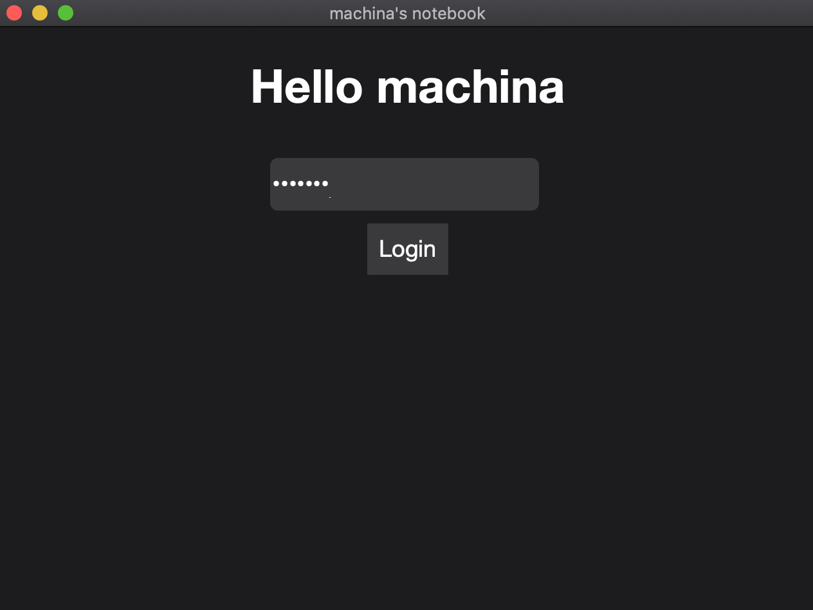

# WebviewToolkit
Cross Platform Lightweight Header Only C++ UI framework to develop desktop apps using Web Technologies. Its in really early development stage and shouldn't be used in commercial projects.

Building the examples
------------


Mac:

``` bash
$ make
```

Linux:

``` bash
$ make
```
(Haven't tested on Linux yet but probably works)

Windows: <br>
Run ***build.bat*** in ***script*** folder

Usage
--------

Copy dist/webviewtk.h in your project and include it in your main script. Your starting point must be wrapped around ***MAIN*** macro as shown in the example to work on windows. <br>
Minimal example:

```cpp
#include "webviewtk.hpp"

MAIN {
	std::string url = "https://www.google.com";
	WVTK::WebviewTK ui = WVTK::WebviewTK(url, "Browser", 480, 640);
	return ui.Run();
}
```

Showcase
--------


